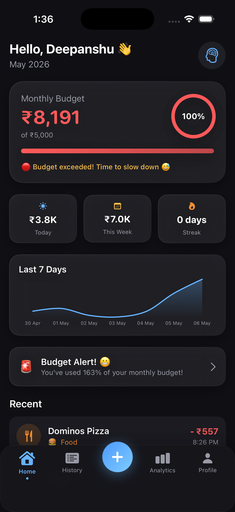
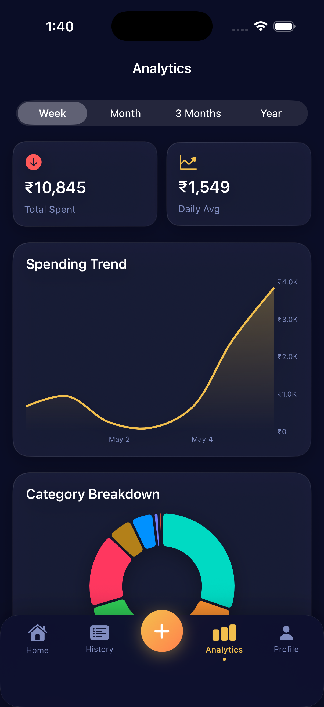
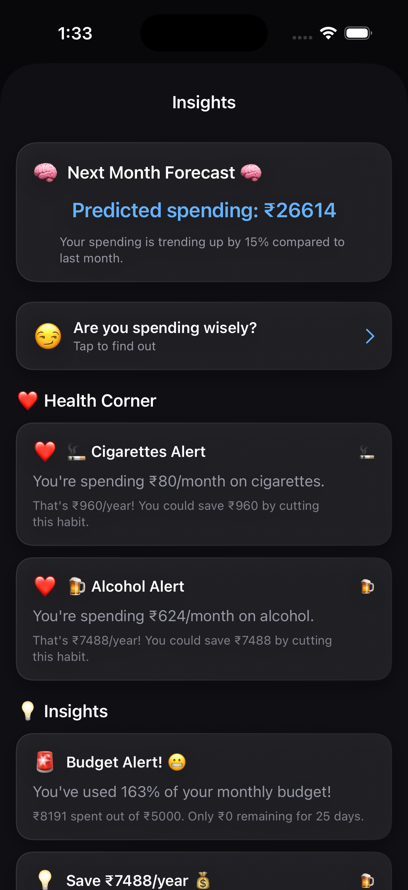
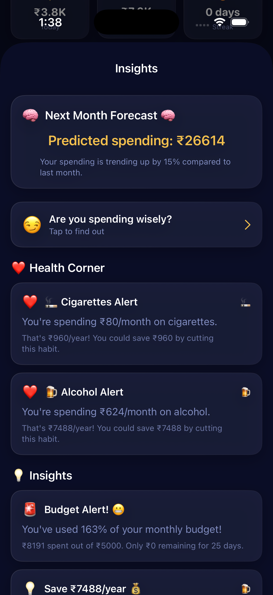

# 💰 SpendWise — Premium iOS Expense Tracker

<p align="center">
  
  
  
  
</p>

**SpendWise** is an intelligent iOS expense tracking application that automatically parses UPI bank SMS messages, categorizes transactions using smart pattern recognition, and provides AI-powered spending insights — all wrapped in a premium glassmorphic dark-mode UI.

---

## 🚀 Problem It Solves

India processes **12+ billion UPI transactions monthly**, yet most people have no idea where their money goes. Bank apps show raw transactions without insights. SpendWise solves this by:

- **Eliminating manual entry** — Paste your bank SMS and it auto-extracts merchant, amount, date & payment method
- **Smart categorization** — Automatically classifies "Swiggy" as Food, "Uber" as Travel, "Amazon" as Shopping
- **Pattern detection** — Catches hidden habits like daily ₹25 cigarette purchases and calculates yearly cost
- **Budget intelligence** — Predicts if you'll overshoot your budget based on spending velocity
- **Health awareness** — Flags risky spending on smoking, fast food, impulse shopping with savings alternatives

---

## ✨ Key Features

### 📱 Transaction Management
- **SMS Paste Parsing** — Paste single or multiple bank SMS messages, auto-extract transaction data
- **Bulk Import** — Parse 10+ messages at once with one tap
- **Manual Entry** — Quick-add with category picker and payment method selector
- **Smart Search & Filter** — Search by merchant, filter by category or payment method

### 📊 Analytics & Insights
- **Interactive Charts** — Spending trends with touch-to-inspect data points (Swift Charts)
- **Category Breakdown** — Animated donut chart showing where money goes
- **Calendar Heatmap** — Visual spending intensity across the month
- **Top Merchants** — See which merchants drain your wallet the most
- **Spending Predictions** — ML-style forecasting of next month's expenses

### 🧠 Smart Intelligence
- **Auto-Categorization** — 15+ categories with keyword-based classification
- **Risk Detection** — Identifies cigarettes, fast food addiction, impulse shopping, late-night ordering
- **Budget Velocity Tracking** — Warns if you're spending faster than your pace allows
- **Savings Calculator** — Shows exact ₹ saved by cutting specific habits
- **Behavioral Insights** — "You spend 40% more on weekends" type analysis

### 🏆 Gamification
- **Streak Tracking** — Days staying under daily budget
- **Achievement Badges** — Unlock badges like "Budget Hero", "Savings Master", "Streak 7"
- **Weekly Savings Score** — Tracks how much you saved vs your goal

### 🎨 Premium UI/UX
- **Glassmorphic Design** — Frosted glass cards with blur effects and subtle borders
- **SF Symbol Icons** — Professional gradient icons replacing all emoji
- **Staggered Animations** — Cards animate in sequence for a premium reveal effect
- **Haptic Feedback** — Tactile response on every interaction
- **4 Themes** — Dark, Light, Neon, Midnight
- **Custom Tab Bar** — Floating add button with bounce animation and matched geometry transitions
- **Payment Badges** — Gradient-styled badges for UPI, Card, Wallet, Bank, Cash

---

## 🏗️ Architecture

```
SpendWise/
├── SpendWiseApp.swift            # App entry point + SwiftData container
├── Components/                   # Reusable UI components
│   ├── PremiumIcon.swift         # Gradient SF Symbol icon system
│   ├── PaymentBadge.swift        # Payment method gradient badges
│   ├── GlassCard.swift           # Glassmorphic card container
│   ├── AnimatedNumber.swift      # Counting number animation
│   ├── CategoryIcon.swift        # Category icon + chip components
│   ├── ConfettiView.swift        # Celebration particle effects
│   └── ShimmerEffect.swift       # Loading shimmer animation
├── Models/                       # Data models (SwiftData)
│   ├── Transaction.swift         # Core transaction model
│   ├── Category.swift            # 15+ spending categories
│   ├── UserProfile.swift         # User settings + UPI ID
│   └── Achievement.swift         # Gamification badges
├── Views/                        # UI layer
│   ├── MainTabView.swift         # Tab navigation with bindings
│   ├── Onboarding/               # 4-step onboarding flow
│   ├── Dashboard/                # Home screen with budget ring
│   ├── Transactions/             # List, detail, add views
│   ├── Analytics/                # Charts, heatmap, breakdowns
│   ├── Insights/                 # AI insights, achievements
│   └── Profile/                  # Settings, themes, data mgmt
├── ViewModels/                   # MVVM business logic
├── Services/                     # Core services
│   ├── UPIParserService.swift    # SMS regex parser (6 formats)
│   ├── CategorizationService.swift # Smart categorizer + patterns
│   ├── InsightsEngine.swift      # Behavioral analysis engine
│   ├── GamificationService.swift # Streaks + achievements
│   └── SampleDataService.swift   # 90-day demo data generator
├── Theme/                        # Design system
│   └── ThemeManager.swift        # 4 themes + color tokens
└── Utilities/
    ├── Extensions.swift          # Animation modifiers + formatters
    └── HapticManager.swift       # Haptic feedback controller
```

**Pattern:** MVVM (Model-View-ViewModel)  
**Persistence:** SwiftData (Apple's modern ORM)  
**Charts:** Swift Charts framework  
**Min iOS:** 17.0

---

## 🛠️ Tech Stack

| Technology | Purpose |
|-----------|---------|
| **Swift 5.9** | Primary language |
| **SwiftUI** | Declarative UI framework |
| **SwiftData** | Local data persistence |
| **Swift Charts** | Interactive data visualization |
| **MVVM** | Architecture pattern |
| **XcodeGen** | Project file generation |
| **SF Symbols** | Premium iconography |

---

## 📲 How to Run

### Prerequisites
- macOS 14+ (Sonoma or later)
- Xcode 15+ (with iOS 17 SDK)
- [XcodeGen](https://github.com/yonaskolb/XcodeGen) (`brew install xcodegen`)

### Steps
```bash
# 1. Clone the repo
git clone https://github.com/DeepanshuYadav08/SpendWise.git
cd SpendWise

# 2. Generate Xcode project
xcodegen generate

# 3. Open in Xcode
open SpendWise.xcodeproj

# 4. Select iPhone simulator → Press ⌘+R to run
```

---

## 📸 Screenshots

<p align="center">
  
  
  
  
</p>

---

## 🔮 Future Roadmap

- [ ] Widgets for home screen spending summary
- [ ] Export transactions as CSV/PDF
- [ ] Apple Watch companion app
- [ ] Shared expenses & bill splitting
- [ ] Cloud sync with iCloud

---

## 👨‍💻 Author

**Deepanshu Yadav**  
GitHub: [@DeepanshuYadav08](https://github.com/DeepanshuYadav08)

---

## 📄 License

This project is for educational purposes.
